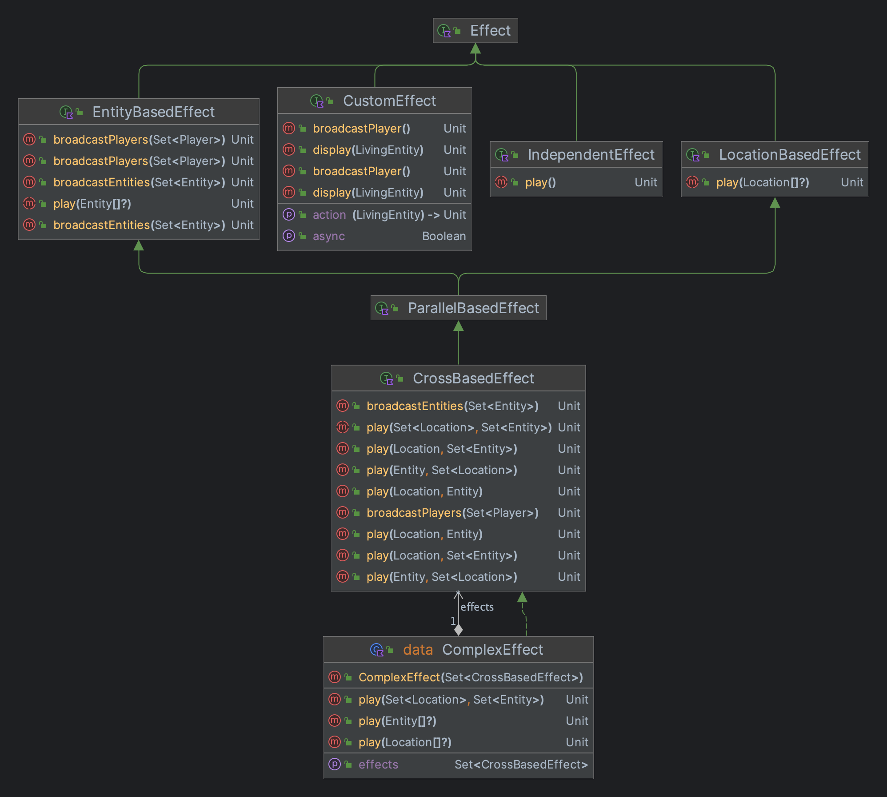
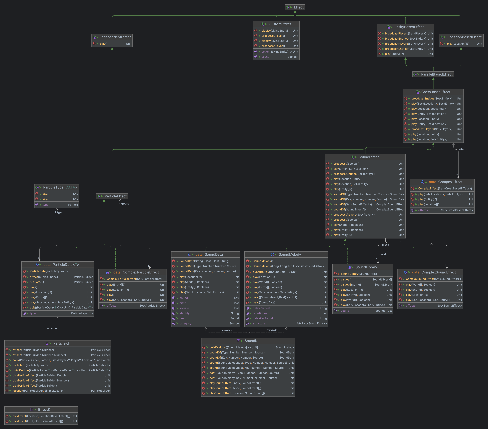

# ⛓ Types


This page is a general description, of each type


There are several types of Effects so every type of effect is covered by a groupable interface. These interfaces are helping us, to give every effect the boundaries, which fit them the most.

## The structure

Here you can see the structure of the effects interfaces:

<figure><figcaption>
The structure of the different effect interfaces
</figcaption></figure>

But this is not all, because we use these effect interfaces in the code of Sparkle. With all these the interfaces are linked into the deepest code, but take a look:

<figure><figcaption>
The current structure, with the Effects
</figcaption></figure>
