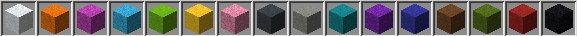

# 🖍 DyeableMaterial

<figure><figcaption>
Every type of wool color (including white)
</figcaption></figure>

## The purpose

Some materials, for example, wool, are having different colors, which they can adapt. In the past, these colors have been handled by the id-system, but now, each wool has its own whole namespaced. This new method of material identification makes it a lot harder, to technically change/adapt/get the colors of the blocks.

But for the situation, of smartly managing colors of materials, Sparkle introduces the DyeableMaterial and ColorType API. This wiki page is about the DyeableMaterial side!

## The materials

Materials, that can have the full spectrum of Minecraft block colors are also listed inside Sparkles DyeableMaterial. But instead of `RED_WOOL`, the DyeableMaterial enum only contains things like `WOOL`, `TERRACOTTA`, `CONCRETE`, `CONCRETE_POWDER`, `CARPET`, ...

So you see, the color prefix is completely not present in the `DyeableMaterial`s!

## The usage

### Get the DyeableMaterial

#### Access

You can get a DyeableMaterial by the enum values, or if you have a material and want to find out, if and which DyeableMaterial it is, you can use the `DyeableMaterial.fromMaterial(Material)` function or the global `Material.dyeable` property. Both ways are returning the matching DyeableMaterial or null if it is not a dyeable Material.

#### Examples

`Material.RED_WOOL.dyeable` -> `DyeableMaterial.WOOL`

`Material.CHEST.dyeable` -> `null`

### Work with a DyeableMaterial

Now you have a DyeableMaterial, which currently does not hold any color. But you want a colored material out of it, for example, a green bed.

Now you can choose to use the `withColor(`[`ColorType`](colortype.md)`)` function which returns the material, which would be this DyeableMaterial with the given [ColorType](colortype.md).

Now you did `DyeableMaterial.BED` + `ColorType.GREEN` -> `Material.GREEN_BED`

### Examples

It may be questioned, where do I need this? For example in minigames like Bedwars, where every team-block, armor, etc. is having their own team color. This would be a place, where such a system would be extremely helpful, to just save the ColorType to a team, and have the ability to get every type of sub-color and dyed material out of this color.

But this discussion is getting out of hand, in the view of the external [ColorType](colortype.md) page, take a look to have more input to process for you!

